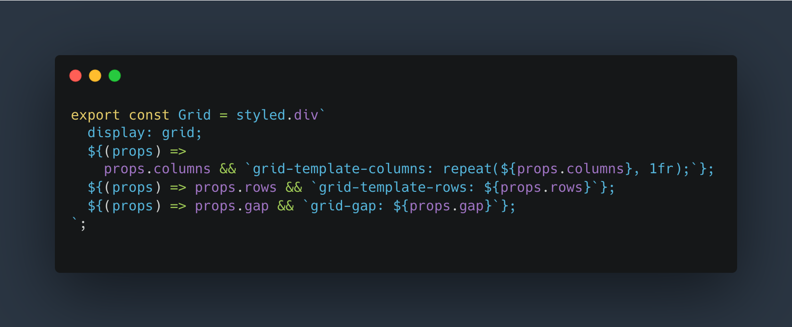
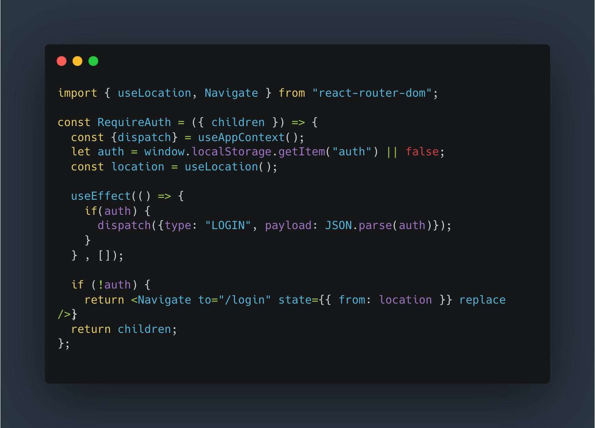
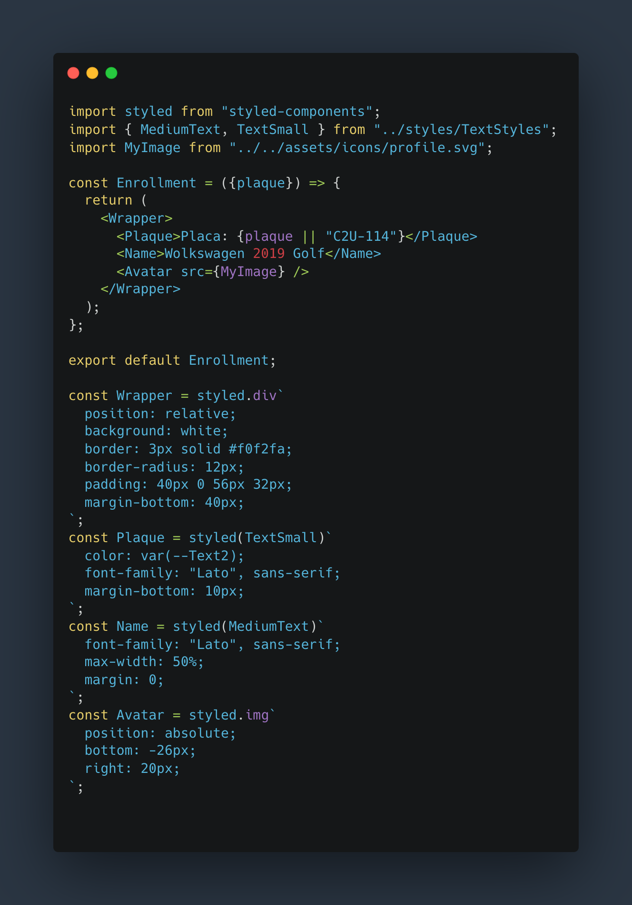
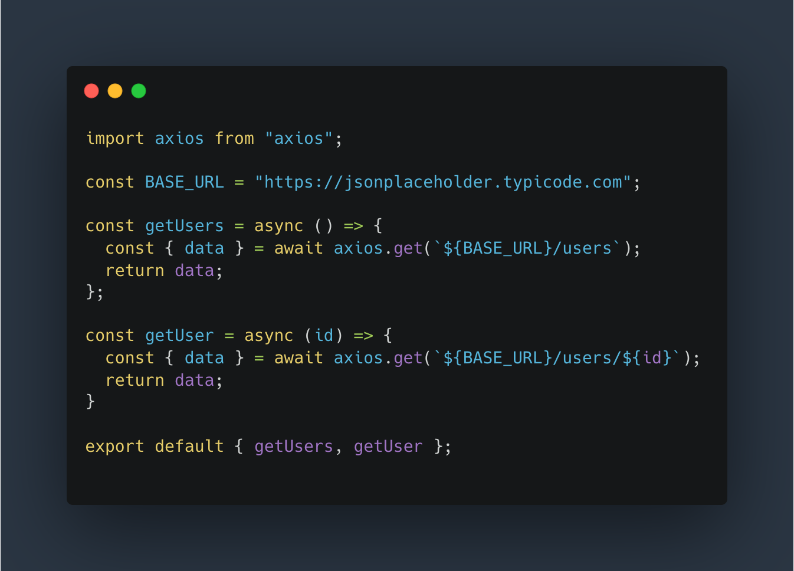
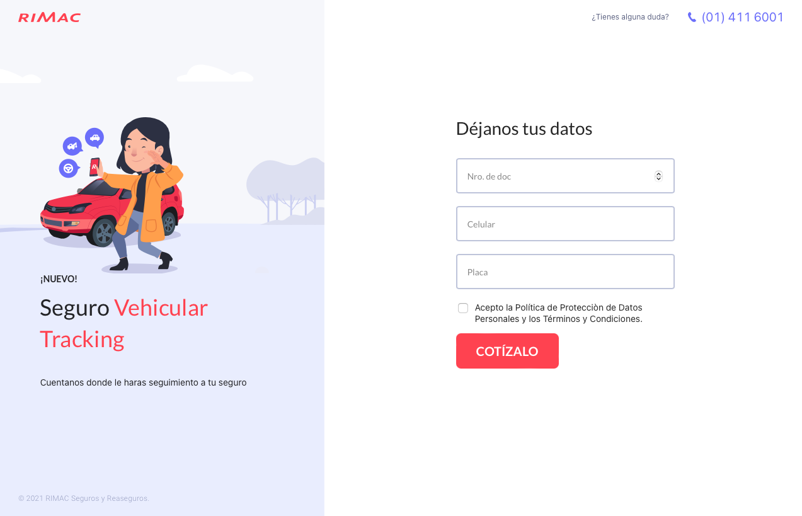
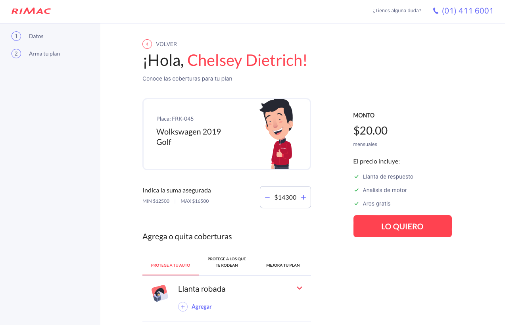
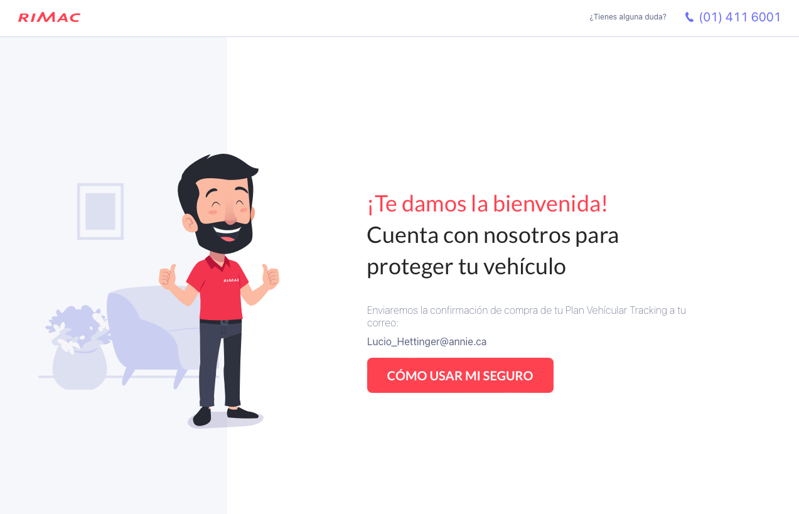

# Getting Started with Create React App

Challenge Rimac Seguros -  Cotizador Seguro
Vehicular.


## Levantar proyecto
En el directorio del proyecto, puede ejecutar:

### `npm install`
Instala los modulos de la aplicacion

### `npm start`

Ejecuta la aplicación en el modo de desarrollo.\
Abra [http://localhost:3000](http://localhost:3000) para verlo en su navegador.

La página se volverá a cargar cuando realice cambios.\
También puede ver errores de pelusa en la consola

# Librerias usadas

-  [React Router](https://reactrouter.com) para crear la navegacion de la aplicacion.

-  [styled components](https://styled-components.com) para la creacion de componetes de mejor performace y reautilizables.

- [Ant Design](https://ant.design) uso de algunos componentes para el feedback al usuario.

### Version
```
"antd": "^4.20.1",
"react-router-dom": "^6.3.0",
"styled-components": "^5.3.5",
```
# Code
### Creacrion de estilos usando styled-componets


### Rutas Privadas usando React Router


### Estructura de un componente 


### Consumo de API


# Preview

### Login


### Main


### Welcome


